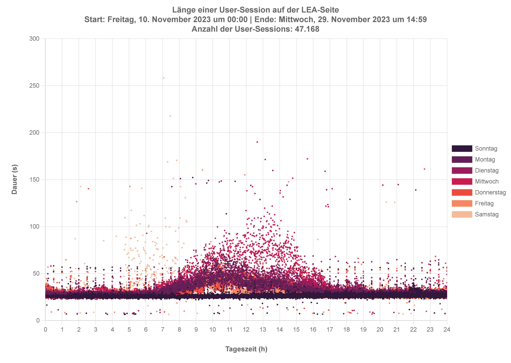
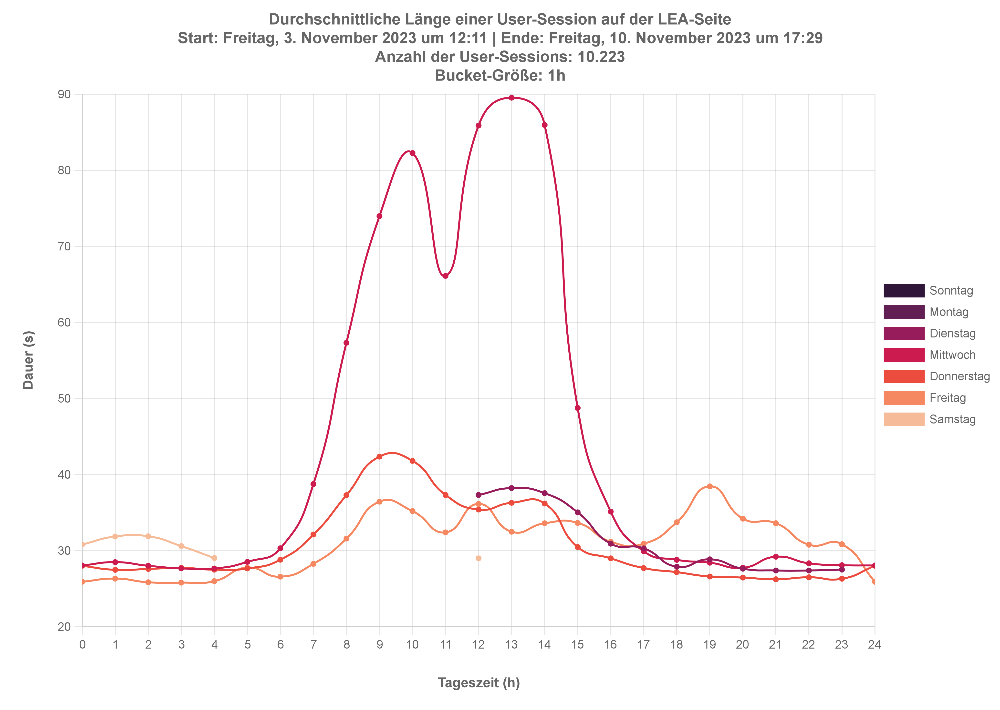
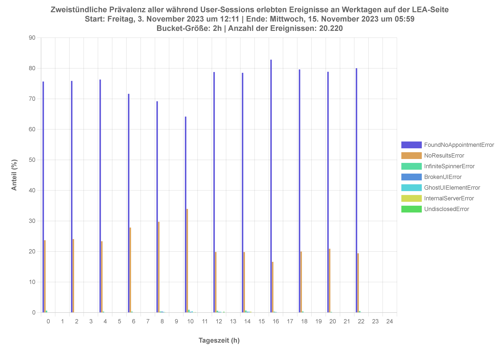
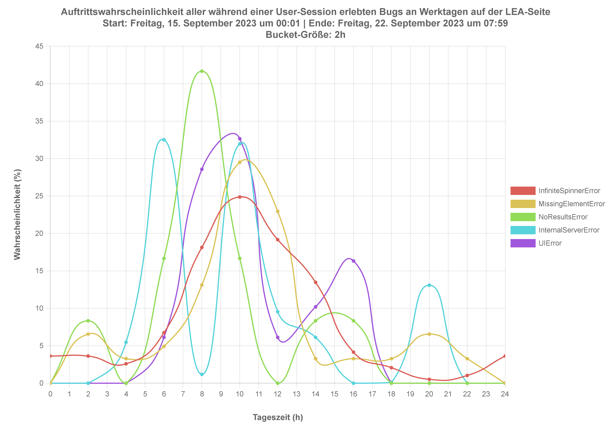

# BerlinLEAPerformanceMonitor

## Description
This is a Node application, which uses a Selenium-based web driver to go through each of the required steps involved in the booking of an appointment at the Landesamt für Einwanderung in Berlin (LEA) on the latter's web portal. It provides a few utility functions, which allow for the parsing of the logs generated by the driver and, consequently, the generation of various graphs depicting the LEA website's performance on a daily basis. Only one instance of the driver is ever allowed to be created at a time: there is no use of parallelization, as this app is not meant to affect the (already poor) availability of LEA's website.

## Motivation
Booking an appointment with the Landesamt für Einwanderung of Berlin is a very difficult endeavor. Even trying months in advance doesn't cut it: finding an appointment to, for instance, renew/extend a visa at LEA is literally impossible, since usually only a handful of appointment slots are freed each day, if any at all. Here is a (non-exhaustive) list of things I have personally tried in order to get an appointment with LEA, all of which were unsuccessful:

- Send an e-mail to the appropriate Referat of LEA
- Send a fax to the appropriate Referat of LEA
- Call the Bürgerservice of Berlin
- Send an e-mail to my Bezirksamt
- Send an e-mail to the Bürgermeister of Berlin

## Performance Analysis
Not only are there almost never any free appointment slots on LEA's portal, the latter is also quite buggy. In an effort to highlight the poor performance of said portal, the following graphs have been generated:

### Length of User Session Until Failure
Time spent on LEA's website until a user can reasonably conclude that there is no available appointment fitting their needs at the moment. If any of the following errors is encountered (see section <b>Prevalence of Events on Workdays (Monday to Friday)</b> for a detailed explanation of each error), the session is deemed a failure:
- ```FoundNoAppointmentError```
- ```NoAppointmentInformationError```
- ```NoResultsError```
- ```InfiniteSpinnerError```
- ```GhostUIElement```
- ```BrokenUIError```

<p align="center" width="100%">
  
</p>

### Average Length of User Session Until Failure
Average time spent on LEA's website by its users before the latter are met with the error message 'there are no available appointments' at the moment. Said average is computed for each time bucket.

<p align="center" width="100%">
  
</p>

### Prevalence of Events on Workdays (Monday to Friday)
Prevalence of all events experienced by the users of the LEA website, from Monday to Friday, Said prevalence for an error ``e`` and a bucket ``b`` is given by the ratio between the number of occurences of ``e`` in ``b`` vs. the total number of occurences for all considered errors within bucket ``b`` on workdays.

- ``FoundNoAppointmentError`` After submitting their search query for an appointment, the user is met with an error message that says: there are no vacant slots for the appointment you are trying to book.
- ``NoAppointmentInformationError`` After submitting their search query for an appointment, the user is met with an error message that says: there is no information available about the appointment you are trying to book.
- ``NoResultsError`` After submitting their search query for an appointment, a loading spinner appears, and then... nothing happens. The user is redirected to the previous form page, as though they had not launched their query.
- ``InfiniteSpinnerError`` A loading spinner was shown for more than 2 minutes: after this time, it is reasonable to assume the user has closed the window.
- ``ConstructionWorkError`` There are currently construction works on LEA's portal. Note: I have personally observed the indicated times (i.e. when the construction works started and when they should end) to be most often erroneous, if specified at all.
- ``InternalServerError`` The LEA servers are responding with the standard HTTP status code 500, which "indicates that the server encountered an unexpected condition that prevented it from fulfilling the request." [1]
- ``ServiceUnavailableError`` The LEA servers are responding with the standard HTTP status code 503, which "indicates that the server is not ready to handle the request." [2]
- ``UndisclosedError`` A generic error page is displayed to the user, with no information whatsoever about what the problem is.
- ``GhostUIElement`` An interactive web element (e.g. button, checkbox) was expected on the bot's path, but wasn't detected (i.e. either a UI bug, or it never loaded).
- ``BrokenUIError`` The expected page structure was broken (e.g. hundreds, if not thousands, of duplicated buttons).

<p align="center" width="100%">
  
</p>

### Likelihood of Errors on Workdays (Monday to Friday)
Likelihood of errors experienced by the users of the LEA website, from Monday to Friday, which prevent them accessing the appointment
assignment feature altogether. Said likelihood for an error ``e`` and a bucket ``b`` is given by the ratio between the number of occurences of ``e`` in ``b`` vs. the total number of occurences of ``e`` on workdays. In other words: if one of the considered errors is to happen, when is it likely to do so? Here is the list of errors considered when plotting the graph below:

- ```NoAppointmentInformationError```
- ```NoResultsError```
- ```InternalServerError```
- ```ServiceUnavailableError```
- ```UndisclosedError```
- ```InfiniteSpinnerError```
- ```GhostUIElement```
- ```BrokenUIError```

<p align="center" width="100%">
  
</p>

## Recommendations
In light of the current performance of LEA's portal (see previous section), and based on my empirical observations as a software engineer, I would suggest the following to the immigration office of Berlin:
- Ensure your servers can be horizontally scaled up based on real-time analysis of web traffic. This will reduce the average time it takes for user to find out whether any appointment is available or not.
- Implement bot/crawler detection to avoid virtual visitors and allow real users access to your resources.
- Implement protection against DoS/DDoS attacks to protect the availability of your services. As the single governmental instance allowed to distribute immigration visas in Berlin, any downtime of your services amounts to economical consequences for both you and immigrants in the capital. For more information on such attacks, see: https://owasp.org/www-community/attacks/Denial_of_Service

## Disclaimer
The source code in this repository is not meant to be used as a means to obtain an actual appointment at the Landesamt für Einwanderung in Berlin. Its sole purpose is educational: my goal is to highlight the poor access to immigration-related online services in Berlin, in 2023. I reject all responsibility for any harm that could be caused by its misuse.

## References
[1] https://developer.mozilla.org/en-US/docs/Web/HTTP/Status/500  
[2] https://developer.mozilla.org/en-US/docs/Web/HTTP/Status/503
