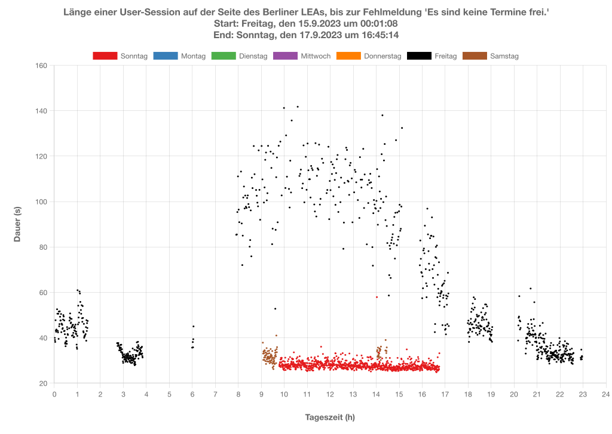

# BerlinLEATerminBot

## Motivation
Booking an appointment with the Landesamt für Einwanderung (LEA) of Berlin is a very difficult endeavor. Even trying months in advance doesn't cut it: finding an appointment to, for instance, renew/extend a visa at LEA is literally impossible, since usually only a handful of appointment slots are freed each day, if any at all. Here is a (non-exhaustive) list of things I have personally tried in order to get an appointment with LEA, all of which were unsuccessful:

- Send an e-mail to the appropriate Referat of LEA
- Send a fax to the appropriate Referat of LEA
- Call the Bürgerservice of Berlin
- Send an e-mail to my Bezirksamt
- Send an e-mail to the Bürgermeister of Berlin

## Description
This Node application uses Selenium to automatically go through each of the required steps involved in the booking of an appointment at LEA on the latter's web portal.

## Performance
Not only are there almost never any free appointment slots on LEA's portal, the latter is also quite buggy. In an effort to highlight the poor performance of said portal, the following graphs have been generated:

  

